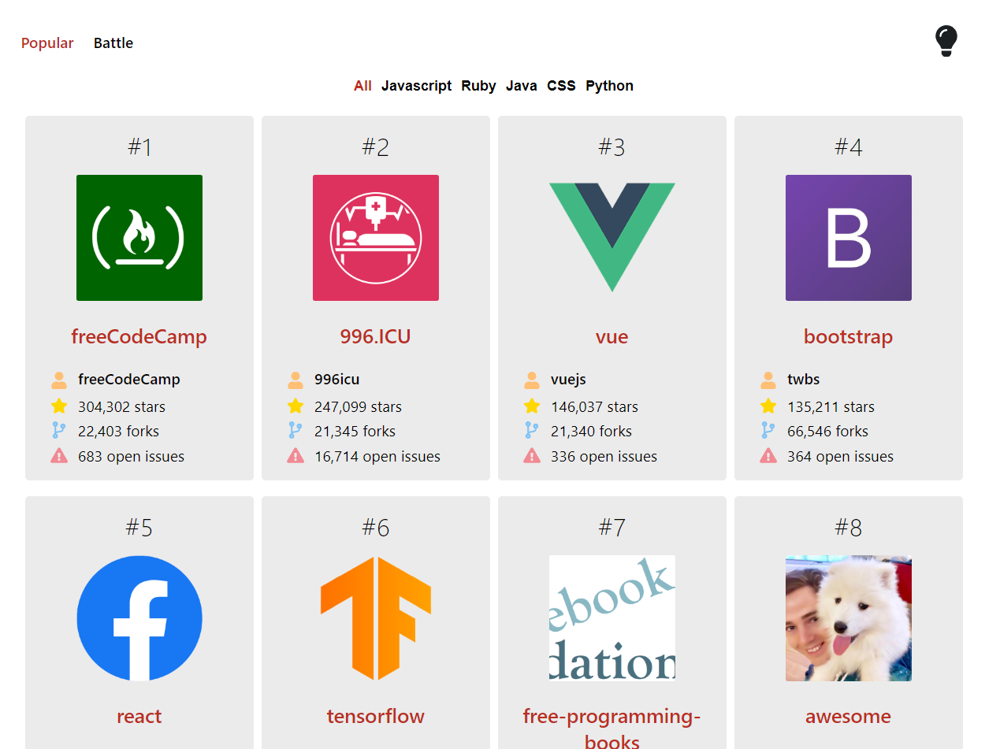
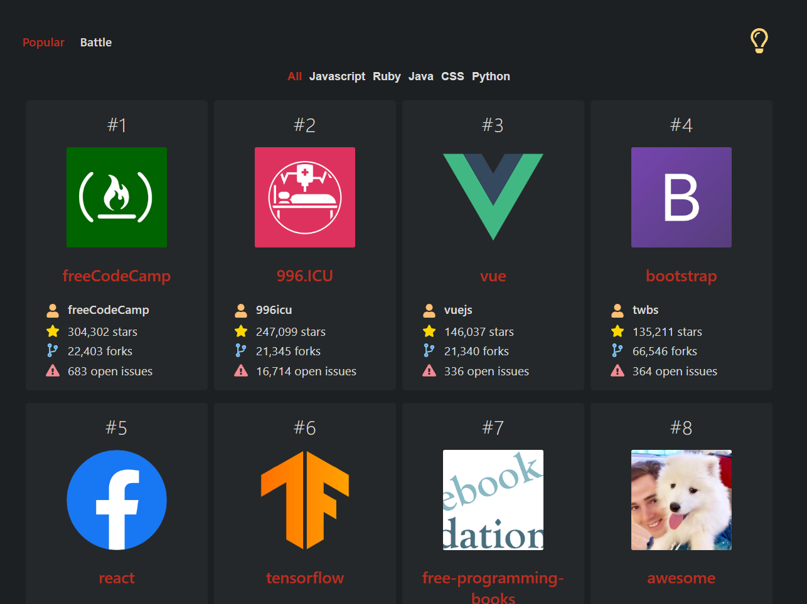
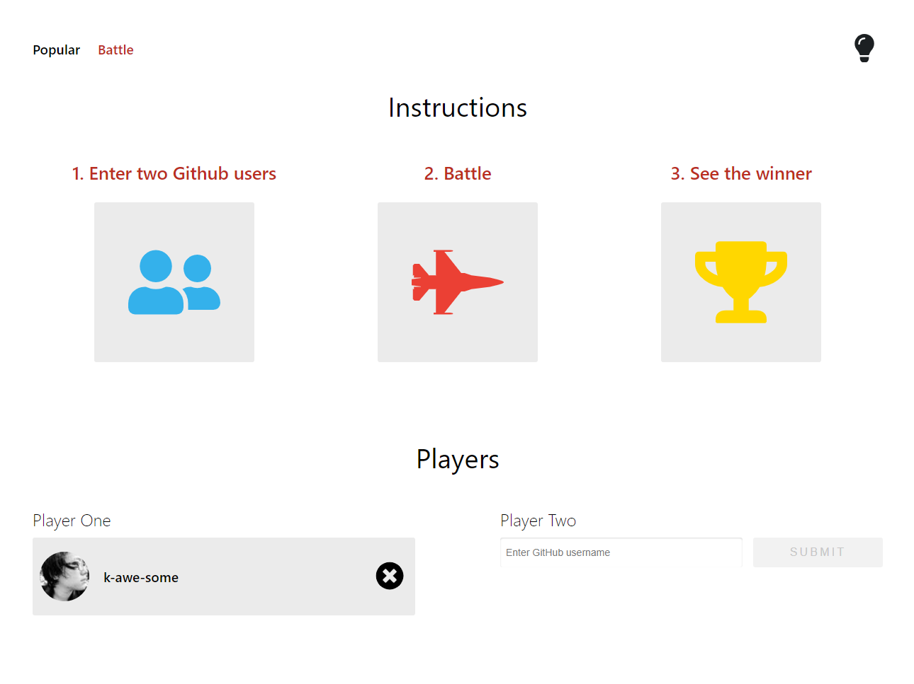
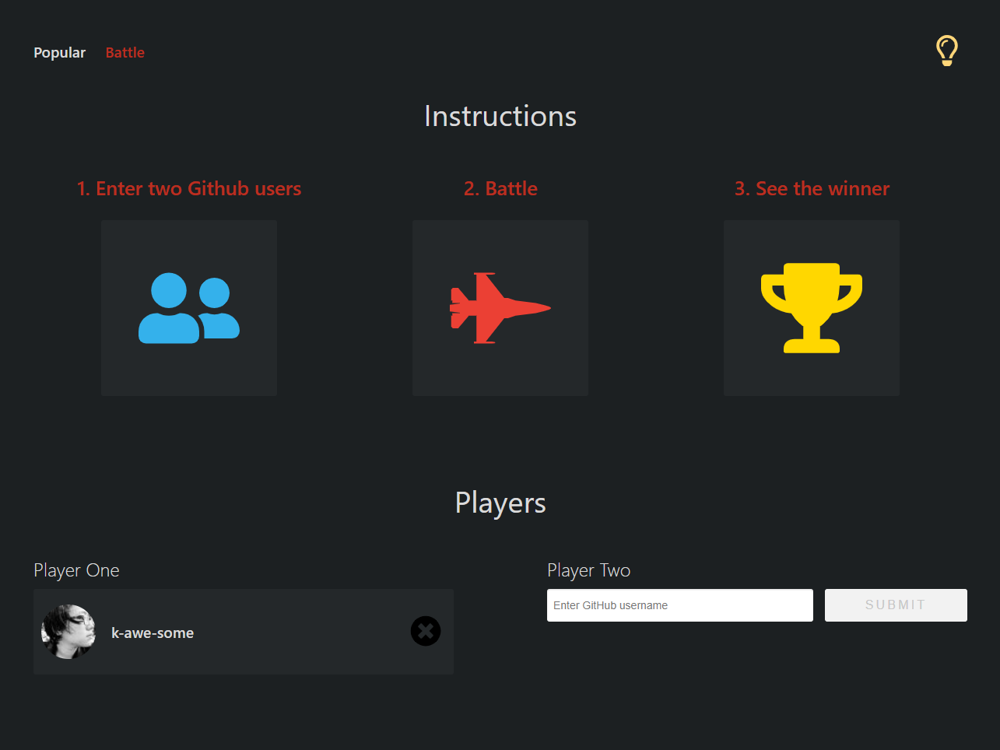
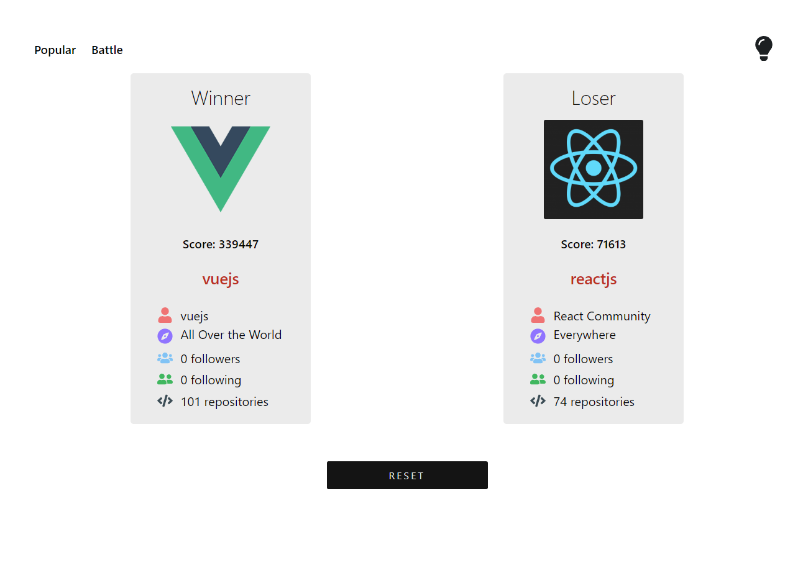
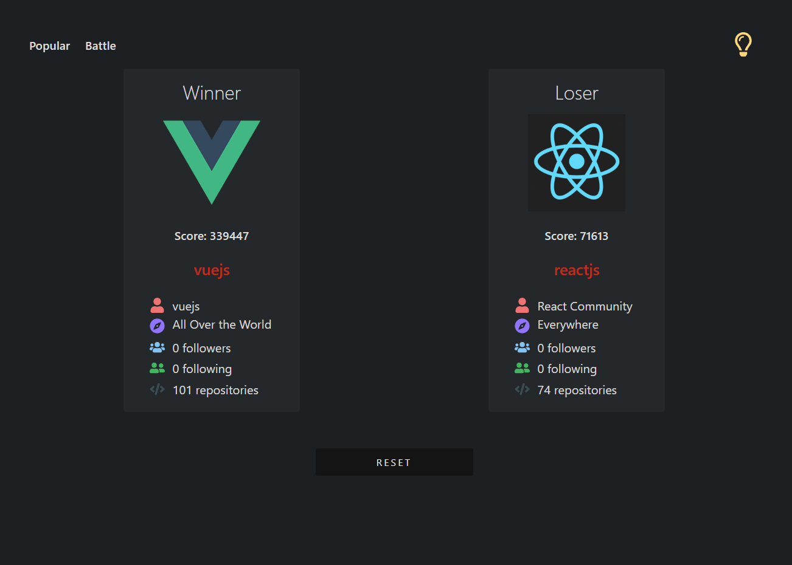

# GitHub Battle

[GitHub Battle](https://github-battling.herokuapp.com/) is a **ReactJS-based** web app that displays the most popular GitHub repositories in a variety of languages and also allows two GitHub users to battle.

## Description

Using the [GitHub API](https://developer.github.com/v3/), the current version of this app fetches the most popular repos from GitHub in **Javascript, Ruby, Java, CSS and Python** languages. Each repo comes with such information as _repo name, username, user avatar, and the number of stars, forks and open issues_.

The Battle tab allows two GitHub users to 'battle' to see which one has a better profile. The results are based on the number of stars and followers each user has at the time of battling.

A night mode is also implemented for readability purposes, which can be toggled by clicking the top right corner 💡 icon.

## Technologies

This app is created with:

- React.js version 16.8.6
- [GitHub REST API version 3](https://developer.github.com/v3/)

## Visuals

|            Day mode            |          Night mode           |
| :----------------------------: | :---------------------------: |
|  |  |
|   |   |
|  |  |

## Contributing

Pull requests are welcome and appreciated. For major changes, please open an issue first to discuss what you would like to change.

## Sources

This app is inspired by [@tylermcginnis](https://github.com/tylermcginnis) 's React tutorials.

## License

This app is available under [MIT](https://choosealicense.com/licenses/mit/) license.
